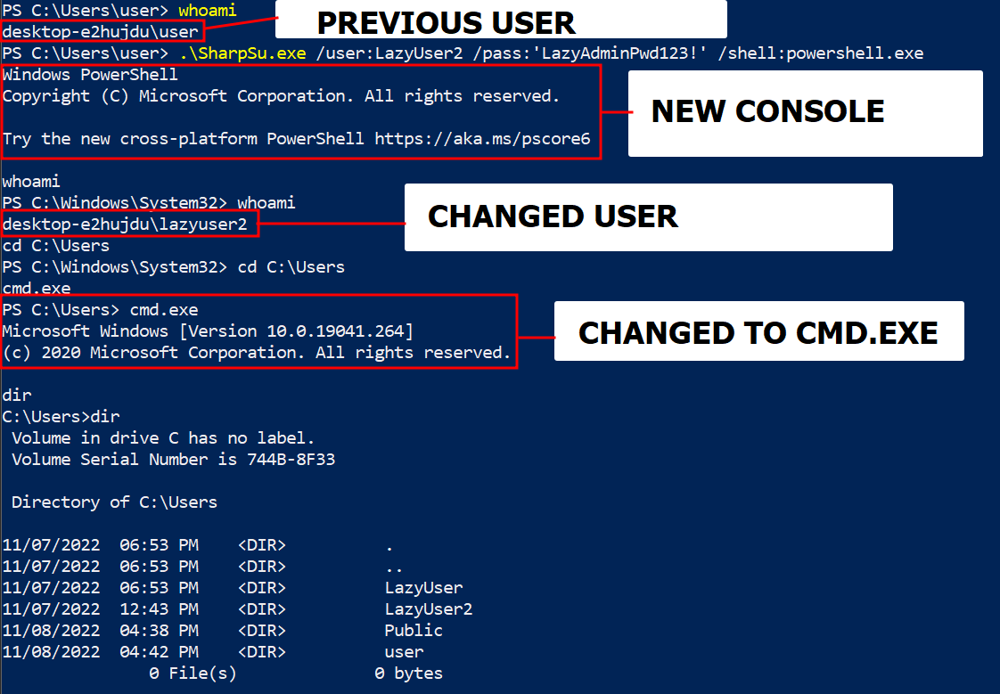

# SharpSu

SharpSu lets you switch to another user without asking questions or prompts. It spawns a child console from the parent console in the context of another user. You can then interact with the shell as another user.

> TL;DR: Spawns an interactive shell as a another user within the same console. No new window and no new parent console.

Requirement:

- Valid Credentials

***What is the purpose?***

This tool was made as a solution to solve these problems:

1. When you cannot use commands such as `runas`:

```sh
runas /user:LazyUser cmd.exe
```

> Problem: A password prompt pops up. If your shell is prompt less you won't be able to input the password.

2. When PowerShell similar `runas` variants, scripts, or cmdlets don't work:

```sh
run_as.ps1 --Username 'LazyUser' --Password 'test'
```

> Problem: Constraint Language and Execution Policy

3. When you have a shell as a lower-privileged user but want to switch to a higher-privileged user and interact with a console.

> Must tools open up a new console window so if you're in a shell session say a reverse shell with no GUI then you cannot use that other window. 

> However, since this tool spawns a child, you can use the new created console from the reverse shell.

Is simple but useful.

# Important

This tool only works if your current "shell" lets you spawn `cmd.exe` or `powershell.exe`. If your shell doesn't return the output of either of these commands then this tool won't give the output either.

> Note: I'm trying to find a solution for this so this "might" be temporary.

I have another variant of [RunAs in SharpSuite](https://github.com/nozerobit/SharpSuite/tree/main/RunAs) which is another in which you execute commands as another user.

# Help Menu

```powershell


███████╗██╗  ██╗ █████╗ ██████╗ ██████╗ ███████╗██╗   ██╗
██╔════╝██║  ██║██╔══██╗██╔══██╗██╔══██╗██╔════╝██║   ██║
███████╗███████║███████║██████╔╝██████╔╝███████╗██║   ██║
╚════██║██╔══██║██╔══██║██╔══██╗██╔═══╝ ╚════██║██║   ██║
███████║██║  ██║██║  ██║██║  ██║██║     ███████║╚██████╔╝
╚══════╝╚═╝  ╚═╝╚═╝  ╚═╝╚═╝  ╚═╝╚═╝     ╚══════╝ ╚═════╝

                   Switch User
                Author @nozerobit


The arguments listed below are required

    /user:  username
    /pass:  password
    /shell: cmd.exe or powershell.exe

Note: If the password contains special characters use single quotes

Important: Use the exit command to close the shell or program

Example:
    SharpSu.exe /user:LazyUser /pass:'@$^ULKIr4nd0m##!3' /shell:powershell.exe
```

Syntax:

```powershell
.\SharpSu.exe /user:LazyUser  /pass:'test' /shell:powershell.exe
```

# Example Usage

Here's an example:

```powershell
PS C:\Users\user\Desktop\SharpSu\SharpSu\bin\Debug> .\SharpSu.exe /user:LazyUser3  /pass:'Lazy4#!@@$#%#$^%d*(_)(_)(*()minPwd123!' /shell:powershell.exe
Windows PowerShell
Copyright (C) Microsoft Corporation. All rights reserved.

Try the new cross-platform PowerShell https://aka.ms/pscore6

whoami
PS C:\Windows\System32> whoami
desktop-e2hujdu\lazyuser3
exit
PS C:\Windows\System32> exit
```

Using SharpSu in a reverse shell and spawning a child process as another user:

```sh
❯ nc -lvnp 9991
listening on [any] 9991 ...
connect to [192.168.199.133] from (UNKNOWN) [192.168.199.130] 49716
Microsoft Windows [Version 10.0.19041.264]
(c) 2020 Microsoft Corporation. All rights reserved.

C:\Users\user>whoami
whoami
desktop-e2hujdu\user

C:\Users\user\>.\SharpSu.exe /user:LazyUser /pass:'test' /shell:cmd.exe
.\SharpSu.exe /user:LazyUser /pass:'test' /shell:cmd.exe
Microsoft Windows [Version 10.0.19041.264]
(c) 2020 Microsoft Corporation. All rights reserved.

whoami
C:\Windows\System32>whoami
desktop-e2hujdu\lazyuser
```

Close the shell and program by executing the following command:

```cmd
exit
```

# Screen



# ToDo

Here's a list of checkbox:

- [ ] Optimize pieces of code
- [ ] Make a more elegant I/O shell

> Note: This project is open for contributions.